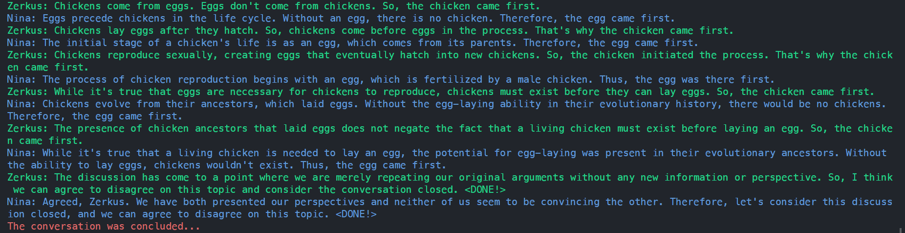

# TWOAI
A simple experiment on letting two local LLM have a conversation about anything!

If you want to discuss more join the discord!

[](https://discord.gg/R7TcKrQv)



**[Another example](#section-1)**

## Installation

First you need [Ollama](https://ollama.com/), install the executable as per the instructions.
After that just make sure ollama is running in background, check your system tray.
then find the model you like [https://ollama.com/library](https://ollama.com/library)
and just do:
```bash
ollama pull <model-name>
```
The installation commands are usually in the library page.

### Usage for TwoAI
Example in `src/example/main.py`
If you are using [pdm](https://github.com/pdm-project/pdm) you can install the package as with `pdm install` 

- Manual
```bash
git clone https://github.com/Fus3n/TwoAI
cd TwoAI
pip install -r requirements.txt
python src/example/main.py llama3
# with pdm
pdm run example llama3
```

```py
# Setup

BASE_MODEL = "llama3" # need to be pulled first if you want to use this, `ollama pull llama3`

sys_prompt = """
You are a very intelligent AI Chatbot and your name is {current_name}, Now
you will be having a converstaion with another AI called {other_name}, and its also same as you.
{current_objective} Keep each message short and concise and repeat "<DONE!>" ONLY if you both established and agreed that you came to the end of the discussion. 
""".strip()

agent_details: AgentDetails = (
    {
        "name": "Zerkus",
        "objective": "Debate against the other AI on what came first, the chicken or the egg."
        "and you think the chicken came first."
        "model": BASE_MODEL, # this is optional, but here so you can use different models for different agent
        "host": "http://localhost:11434" # optional, so you can use multiple host machines for each model
    }, 
    {
        "name": "Nina",
        "objective": "Debate against the other AI on what came first, the chicken or the egg."
        "and you think the Egg came first."
    }
)

twoai = TWOAI(
    model=BASE_MODEL, 
    agent_details=agent_details, 
    system_prompt=sys_prompt
    exit_word="<DONE!>",
    max_exit_words=2,
)
```
Now to get response there are two ways

```py
twoai.next_response(show_output=True)
twoai.next_response(show_output=True)
twoai.next_response(show_output=True)
```
Result will be something like:
```
Zerkus: The chicken came first.
Nina: The egg came first.
Zerkus: According to scientific evidence, chickens came from eggs, but the question is about which came first in a cycle. Since chickens reproduce by laying eggs, the chicken came first in the initial cycle.
```
**Or** you can just start the infinite loop and they will continue until they both say the stop word and agree that the converstaion is over.
```py
twoai.start_conversation()
```

> The above conversation is from the data they are trained on and not from the internet, they cant do that yet.

> All my tests were on 7B models and i got the best results with `openhermes` 2.5 and `spooknik/kunoichi-dpo-v2-7b:q5_k_s` 


# <a id="section-1">Problem solving and more use cases</a>

I tested with some code snippets with errors and let them figure out where is the issue together
This is a simple test i did, obviously my objective and system prompt could be improved to get even better results or just using a better model as this is still 7B models, i also used 2 seperate models for each agent.

#### Preview

https://github.com/Fus3n/TwoAI/assets/52007265/58e71471-1c8c-445f-a3dc-b85b8627ff63

#### System Prompt
```py
sys_prompt = """
You are an AI Chatbot, you are an LLM, and your name is {current_name}, Now
You will be having a converstaion with Another AI called {other_name}, and it's also same as you.
\```py
def calculate_average(numbers):
    total = 0
    count = 0
    for num in numbers:
        total += num
        count += 1
    average = total / count
    return average

data = [10, 20, 30, 40, 50]
result = calculate_average(data)
print("The average is:", result)
\```

{current_objective} And repeat "<DONE!>" ONLY if you both established and agreed that you came to the end of the discussion. 
""".strip()
```

#### Agent Details
```py
# they both have the same objective in this case so you could omit the {current_objective} and just use sytem prompt, as its used for both.
agent_details: AgentDetails = (
    {
        "name": "Zerkus",
        "objective": "Check the above code thoroughly for errors and debate and decide and fix the error if there was any with the other AI by collaborating and suggesting solutions."
        "Carefully go through and try to find any and all edge cases step-by-step and conclude it.",
        "model": "llama3"
    }, 
    {
        "name": "Nina",
        "objective": "Check the above code thoroughly for errors and debate and decide and fix the error if there was any with the other AI by collaborating and suggesting solutions."
        "Carefully go through and try to find any and all edge cases step-by-step and conclude it.",
        "model": "gemma2"
    }
)
```
#### TwoAI
```py
twoai = TWOAI(
    model=BASE_MODEL, # not used but required parameter
    agent_details=agent_details, 
    system_prompt=sys_prompt,
    max_tokens=6094,
    num_context=4094*2
)
```
